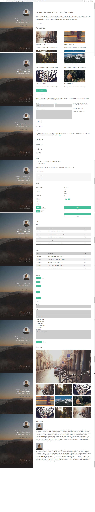

<!--## -->

## Strata Page Project
* The Third Project for the WebDesign Course.
* Developed just for desktop. That isn't a responsive page.

## Technology 

Here are the technologies used in this project.

* HTML5
* CSS3

## Services Used

* Remix Icon
* Github
* Netlify

## Links
  - Icons: https://remixicon.com/
  - Deploy on Netlify: 
  - Repository: 

## Versioning

  1.0.0.0

## Authors

  * **André Baccili** 

  Please follow github and join us!
  Thanks to visiting me and good coding!

  ## Preview / Template

  
